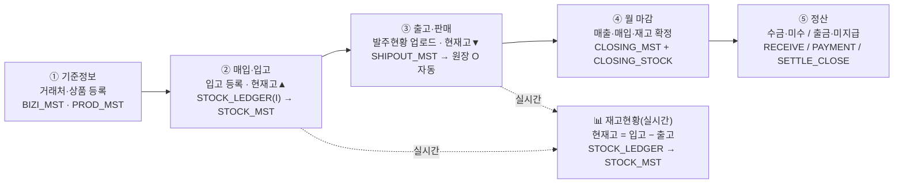

# 물류(도매유통) 화면 ↔ DB 테이블 맵 (개발자 참조)

> konet_web · MSSQL · egovframework(`egovframework.sejong`) · MyBatis · Apache Tiles
> 화면에서 `Ctrl+Alt+T` 를 누르면 이 표의 요약이 우측 오버레이로 뜹니다.
> 최초 작성 2026-07-05.

---

## 0. 업무 흐름도

**기준정보 → 매입·입고 → 출고·판매 → 월 마감 → 정산** (+ 실시간 재고현황)



텍스트 흐름(뷰어에서 mermaid 미지원 시):
```
①기준정보 → ②매입·입고 → ③출고·판매 → ④월 마감 → ⑤정산
 BIZI/PROD   LEDGER(I)     SHIPOUT       CLOSING     RECEIVE/PAYMENT
 _MST        →STOCK_MST    →원장 O 자동   _MST/_STOCK  /SETTLE_CLOSE
                 │             │
                 └── 실시간 ──▶ 📊 재고현황 = 입고 − 출고 (STOCK_LEDGER→STOCK_MST)
                                · 기준일=마감월 말일 → ④재고마감 기말과 대사
```

**단계 요약**
1. **기준정보** — 거래처(`TBL_BIZI_MST`)·상품(`TBL_PROD_MST`) 등록
2. **매입·입고** — 입고 등록 → 수불원장 `IO_GB='I'` → 현재고 증가·이동평균단가 갱신
3. **출고·판매** — 발주현황(SHIPOUT) 업로드 → 원장 `IO_GB='O'` 자동연동 → 현재고 감소
4. **월 마감** — 매출·매입·재고 마감(4화면 통합) → 확정 시 `TBL_CLOSING_MST`(월1행)+기말 스냅샷+원장 잠금+다음달 이월
5. **정산** — 수금/미수(`RECEIVE`)·출금/미지급(`PAYMENT`), 전월이월+당월−회수/지급=잔액, 월마감(`SETTLE_CLOSE`)
- **재고현황(실시간)**: ②입고−③출고를 원장 단일 소스로 즉시 반영. 기준일=마감월 말일 → ④재고마감 기말과 대사.

---

## 1. 화면 ↔ 테이블 매핑 (좌측 메뉴 순서)

### 조회·대시보드관리
| 화면 | 주 테이블 | 비고 |
|---|---|---|
| 출고현황표(대시보드1/2) · 출고세부조회 | `TBL_SHIPOUT_MST` | 배치키 = 납기 `DLV_DT` + 출고일 `SHPOUT_DT` + 출고장 `DC_CD`. 버전 `JOB_SEQ`, 활성 `ACTION_YN='Y'`(재업로드 시 이전 배치 'N'). 품목 `ITEM_CD`, 수량 `CUR_QTY`, 사업장 `BIZ_CD`(키 아님) |

### 매입·재고관리
| 화면 | 주 테이블 | 비고 |
|---|---|---|
| 입고내역 | `TBL_STOCK_LEDGER` (`IO_GB='I'`) | 매입처 `VENDOR_CD` |
| 재고현황 | `TBL_STOCK_LEDGER` 집계 + `TBL_STOCK_MST`(현재고 캐시) | 현재고 = 입고(I·R·A) − 출고(O). 출고는 `TBL_SHIPOUT_MST`→원장 `O`행 자동연동(`REF_GB='SHIPOUT'`, `REF_NO=SHPOUT_DT`). 기준일 비움=전체(현재고)/날짜=그날까지 누계(기말→재고마감과 대사). 행 클릭=수불 내역(근거) |
| 상품(품목)관리 | `TBL_PROD_MST` (+이력 `TBL_PROD_INPRICE_HST` / `TBL_PROD_SALEPRICE_HST`, 재고 `TBL_STOCK_LEDGER`/`TBL_STOCK_MST`) | 하단 도킹 3탭(매입가/판매가/재고) |

### 마감관리 (월마감)
| 화면 | 주 테이블 | 비고 |
|---|---|---|
| 매출마감 | `TBL_SHIPOUT_MST` × 유효단가 | 단가 = 출고일 시점 `SALEPRICE_HST`/`INPRICE_HST`, 없으면 `TBL_PROD_MST` |
| 매입마감 | `TBL_STOCK_LEDGER` 입고(`IO_GB='I'`) × 매입처(`VENDOR_CD`) | 입고(수불) 기준 |
| 재고마감 | `TBL_STOCK_LEDGER` 기간집계 + 이월 `TBL_CLOSING_STOCK` | 기초 + 입고 − 출고 ± 조정 = 기말 |
| 마감현황(월계표) · 월별 마감이력 | `TBL_CLOSING_MST` (+`TBL_CLOSING_STOCK`) | 확정 잠금 `STATUS='C'`. 확정 시 해당월 원장 잠금(guardClosed) |

### 정산관리 (월 단위, 마감/이월/잠금)
| 화면 | 주 테이블 | 비고 |
|---|---|---|
| 수금 / 미수금 | `TBL_RECEIVE_MST` (거래처×귀속월) | 미수잔액 = 전월이월 + 당월매출 − 당월수금 |
| 출금 / 미지급 | `TBL_PAYMENT_MST` (매입처×귀속월) | 미지급잔액 = 전월이월 + 당월매입 − 당월출금 |
| (수금·출금 공통) 월 마감 | `TBL_SETTLE_CLOSE_MST` | `SETTLE_GB` = 'RCV'(수금)/'PAY'(출금), 확정 `STATUS='Y'`. 확정 시 해당월 수정잠금 + 다음달 전월이월 자동반영 |

### 시스템관리
| 화면 | 주 테이블 |
|---|---|
| 거래처관리 | `TBL_BIZI_MST` (사업장/거래처) |
| 회사·사용자 / 공통코드 | 회사·사용자 관리, 공통코드 관리 테이블 |

### 부가·예정 (미구현)
| 화면 | 상태 |
|---|---|
| 물품동선관리 · 견적서관리 · 카카오톡문자관리 | 데모/예정 — 실제 테이블 없음(협의 후 신설) |

---

## 2. 핵심 테이블 요약
| 테이블 | 용도 | 핵심 컬럼 |
|---|---|---|
| `TBL_SHIPOUT_MST` | 출고(발주현황) 원천 | `SHPOUT_DT`·`DC_CD`·`ITEM_CD`·`CUR_QTY`·`JOB_SEQ`·`ACTION_YN` |
| `TBL_STOCK_LEDGER` | 재고 수불원장(모든 입·출·조정·반품) | `IO_GB`(I/O/R/A)·`QTY`·`UNIT_PRICE`·`REF_GB`/`REF_NO`·`ACTION_YN` |
| `TBL_STOCK_MST` | 품목별 현재고 캐시 | `CUR_QTY`·`AVG_IN_PRICE`·`STOCK_AMT` (PROD_SEQ UNIQUE) |
| `TBL_PROD_MST` | 상품 마스터 | `PROD_CD`·`IN_PRICE`·`SALE_PRICE` |
| `TBL_PROD_INPRICE_HST` / `TBL_PROD_SALEPRICE_HST` | 매입가/판매가 이력 | `APPLY_DT` 시점단가 |
| `TBL_CLOSING_MST` / `TBL_CLOSING_STOCK` | 월 마감 헤더 / 기말재고 스냅샷(이월) | `CLOSE_YM`·`STATUS='C'` |
| `TBL_RECEIVE_MST` / `TBL_PAYMENT_MST` | 수금·미수 / 출금·미지급 | `RCV_YM`/`PAY_YM` × `BIZ_CD` |
| `TBL_SETTLE_CLOSE_MST` | 정산(수금/출금) 월 마감상태 | `SETTLE_GB`·`CLOSE_YM`·`STATUS='Y'` |
| `TBL_BIZI_MST` | 사업장/거래처 마스터 | `BIZ_CD` |

---

## 3. 주요 연동·규칙
- **출고 → 재고 연동(A)**: 출고 저장(`saveShipoutMst`) 시 그 출고일자의 `TBL_SHIPOUT_MST` 활성분을 `TBL_STOCK_LEDGER` `O`행으로 재동기화(`REF_GB='SHIPOUT'`, 출고일자별 삭제→재생성) + 전체 현재고 재집계. 재고현황·재고마감이 **원장 단일 소스**로 일치.
  - 최초 1회: 재고현황 **🔄 출고반영 재집계** 버튼(또는 `sql/shipout_ledger_backfill.sql`). 이후 업로드는 자동.
  - 마감 확정월(`STATUS='C'`)은 원장 잠금이라 동기화 skip.
- **재고현황 기준일**: 비움=현재고(전체 누계), 날짜=그날까지 누계(기말). 마감월 말일로 맞추면 재고마감 기말과 대사.
- **정산 자동이월**: 수금/출금 "🔄 전월이월 가져오기" 또는 월 마감 확정 시 전월 잔액 → 당월 전월이월.
- **XML 주의**: `<`, `<=` 는 CDATA 필수. 날짜는 `NVARCHAR` 문자저장, 저장 시 `REPLACE(...,'-','')`.

### 용어: 이동평균단가 (AVG_IN_PRICE)
재고 1개당 **평균 매입원가**. 입고할 때마다 기존 재고 + 새 입고를 가중평균해 다시 계산(입고 시 이동, 출고 시 불변).
- **개념식**: `새 평균 = (기존수량×기존평균 + 입고수량×입고단가) / (기존수량+입고수량)`
- **이 시스템 계산(`recalcStockMst`)**: `AVG_IN_PRICE = Σ(입고수량×입고단가) / Σ(입고수량)` = 원장 입고행 전체 가중평균(총평균에 가깝지만 결과 유사). 입고단가 = `TBL_STOCK_LEDGER.UNIT_PRICE`(입고행).
- **용도**: `재고금액 = 현재고 × 이동평균단가` (재고평가), 매출원가 기준.
- **주의**: 입고가 없으면(입고합 0) 단가 정보가 없어 **0**. 입고(단가 포함) 등록 시 채워짐. 출고(SHIPOUT)만으로는 원가 기준이 없어 0.
- 예) 입고 100@1,000 → 평균 1,000 / 입고 50@1,300 → (100×1,000+50×1,300)/150 = **1,100** / 출고 30 → 평균 1,100 유지.

---

## 4. 단축키
| 키 | 화면 | 동작 |
|---|---|---|
| **Ctrl + Alt + T** | 물류 메인(logistics_demo2.jsp) | 화면↔테이블 정보 오버레이 토글(개발자용, 평소 숨김). 구현: `#tblinfoPanel` |
| **Ctrl + Del** | 출고현황표(대시보드1, logistics_demo1.jsp) | **출고장 삭제 아이콘(🗑️) 켜기/끄기 토글**(기본 숨김, `body.d2-del-on`). 켠 뒤 출고장의 🗑️ 클릭 → 그 출고일자·출고장 출고분 삭제(이력 보존 `ACTION_YN='N'`). 구현: `d2Del*` 함수군 |

> 두 단축키는 서로 다른 문서(부모 demo2 / iframe demo1)에 있어 충돌 없음. iframe에 포커스가 있으면 해당 문서의 단축키가 동작.

---

## 5. 배포 메모
- `.java` / `.xml` 변경 → **WAR 재빌드 + 톰캣 재기동** (Eclipse는 외부 생성 파일이면 F5 → Clean 선행)
- `.jsp` 만 변경 → 파일 반영 후 **Ctrl+Shift+R**. iframe 화면(수금/출금/상품/거래처)은 강력 새로고침으로 캐시 제거
- 신규 테이블 스크립트: `sql/` 아래 (`*_ddl.sql`) — DB에서 선실행 필요
